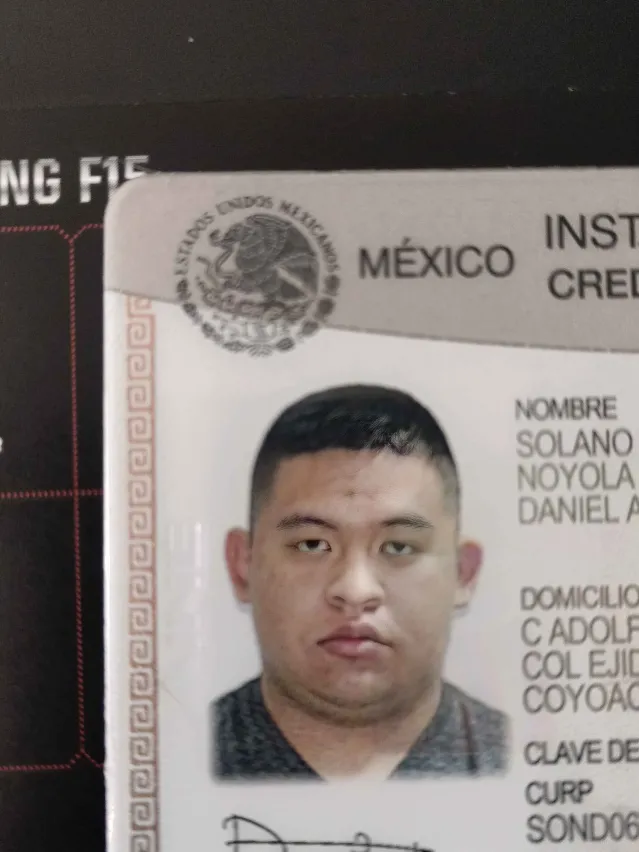

# Daniel Alberto Solano Noyola

_Mi nombre es Daniel , tengo 19 años y actualmente estudio la carrera de ingenieria en desarrollom de software , elegí la carrera por varios motivos : me gusta la programación , los videojuegos , las experiencias que nos pueden brindar , me gustaría en un futuro trabajar haciendo motores gráficos para juegos o nuevas versiónes de Unreal o Unity , en algún juego de carreras en donde las fisicas importen o tambien me gustaría trabajar en la empresa de Nvidia._

#### Mis pasatiempos :

1. Ver carreras de autos , en especial las de endurance .
2. Nadar 
3. Leer comics o novelas.
4. Jugar videojuegos.
5. Jugar con mis perritas ( Tnego 4 ).
6. Ver documentales de autos de carreras o de videojuegos.
7. Regar mi jardin.

#### Forma de contacto : 
- [Instagram](https://www.instagram.com/ares499p?igsh=MWd1NXExcWxsamg5NA==)

- [Steam](https://steamcommunity.com/profiles/76561199791529419/)

#### Yo

# Entregables 
- [Practica 3](./mds/etiquetas.md)
- [Práctica 2](mds/ramas-fusiones.md)
- [Practica 4](mds/primer-parcial.md)