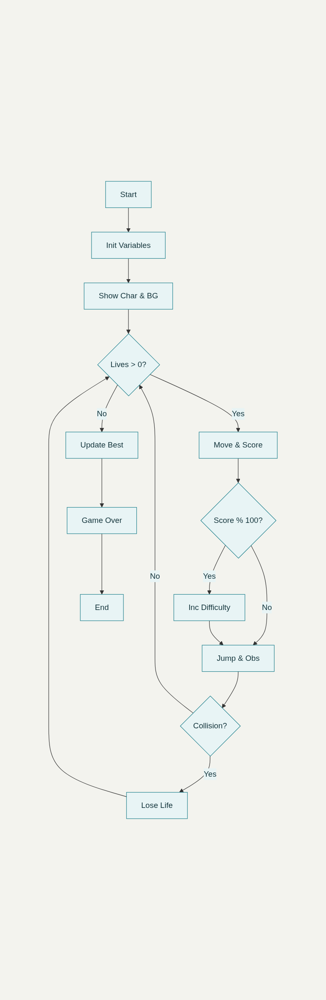

# Dragon Web ReQuest

## Lore 

En las tierras lejanas WEB  de el Emperador Atuma , un gran dragon de dimensiónes gigantescas llamado SyntaxError ha despertado y quiere recuperar sus tierras , el emperador ha llamado al caballero más valiente de estas tierras : Hector Matias Thomas Lopez , bien conocido como HTML , para salvar las tierras web . 

## Reglas Y Mecanicas 

### Reglas : 

 - El jugador controla al caballero HTML que corre automáticamente por las tierras web.

- El objetivo es saltar para esquivar enemigos y obstáculos.

- El jugador comienza con 3 vidas.

- Si el caballero toca un enemigo u obstáculo, pierde una vida.

- Cuando se pierden las 3 vidas, el juego termina.

- La puntuación aumenta conforme avanza el tiempo (por ejemplo, cada cierto tiempo o distancia avanzada).

- Por cada 100 puntos, la dificultad (velocidad y obstáculos) aumenta.

- Se guarda la puntuación más alta lograda localmente para mostrarla en futuras partidas.

### Mecánicas :

- Movimiento automático hacia la derecha del caballero.

- Salto para evitar colisiones con enemigos u obstáculos.

- Sistema de vidas que decrementa con cada golpe.

- Incremento progresivo de la velocidad y dificultad conforme aumenta el puntaje.

- Al terminar el juego, se compara la puntuación actual con el récord guardado y se actualiza si se supera.

### Algoritmo : 

1. Inicializar variables: vidas = 3, puntuación = 0, velocidad_inicial, mejor_puntuacion (cargar de localStorage).

2. Mostrar caballero y fondo de tierras web.

3. Mientras vidas > 0:

4. Mover caballero automáticamente hacia la derecha a velocidad actual.

5. Incrementar puntuación con el tiempo.

6. Cada 100 puntos, aumentar la velocidad y dificultad.

7. Detectar si el jugador presiona la tecla salto.

8. Si se presiona salto y el caballero está en tierra, hacer que salte.

9. Generar y mover enemigos y obstáculos a la derecha hacia la izquierda.

10. Detectar colisiones del caballero con enemigos/obstáculos.

11. Si hay colisión, restar 1 vida.

12. Cuando vidas = 0:

13. Comparar puntuación actual con mejor_puntuacion.

14. Si puntuación actual > mejor_puntuacion, actualizar mejor_puntuacion y guardar en localStorage.

15. Mostrar pantalla de "Juego Terminado" con la puntuación y mejor puntuación.

16. Fin.

### Prompt para la IA :

_Me podrías dar el código en HTML para que lo ponga en mi página de GitHub y ya cuando abra la página se ejecute ... 
recuerda que es un caballero que corre por una tierra plana saltando bolas de fuego , cada 100 puntos aumenta el ritmo , tienes 3 vidas y a la última game over , el score es Como el de el dinosaurio de Google cuando no tienes internet , se guarda la puntuación más alta y al final aparece un botón de reintentar._

[Conversación con Luz](https://www.perplexity.ai/search/luz-te-acuerdas-de-mi-juego-we-01sWrB1eTE.XfBjWswppRA#0)